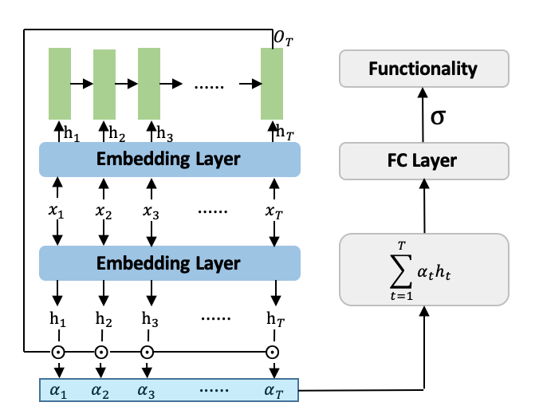

# Attention_AD
<a href="https://github.com/marktext/marktext/releases/latest">
   
   
   
   
   
</a>  

Attention_AD is a computational tool using deep learning that can identify gene activation, which is for the dataset in "Activation of gene expression by nucleosome detergents".

Copyright (C) 2021 Xiao Wang, Daisuke Kihara, and Purdue University. 

License: GPL v3. (If you are interested in a different license, for example, for commercial use, please contact us.) 

Contact: Daisuke Kihara (dkihara@purdue.edu)

## Citation:
Bradley K. Broyles, Andrew T. Gutierrez, Theodore P. Maris, Daniel A. Coil, Thomas M. Wagner, Xiao Wang, Daisuke Kihara, Caleb A Class & Alexandre M. Erkine. Activation of Gene Expression by Detergent-like Protein Domains. iScience(Submitted) (2021).
```
@article{bradley2021,   
  title={Activation of Gene Expression by Detergent-like Protein Domains},   
  author={Bradley K. Broyles, Andrew T. Gutierrez, Theodore P. Maris, Daniel A. Coil, Thomas M. Wagner, Xiao Wang, Daisuke Kihara, Caleb A Class, and Alexandre M. Erkine},    
  journal={iScience(submitted)},    
  year={2021}    
}   
```

## Introduction
The mechanisms by which transcriptional activation domains (tADs) initiate eukaryotic gene expression have been an enigma for decades because most tADs lack specificity in sequence, structure, and interactions with targets. Machine learning analyses of in vivo generated sequence datasets revealed that highly variable tAD sequences are characterized by the preferred near-terminal location of the aromatic extremity and internal positions of acidic residues. The abundance of both aromatic and acidic amino acids in the tAD greatly increases the functionality. tADs likely affect the gene promoter chromatin environment, functioning as nucleosome surfactants rather than as recruiters of coactivators. This mechanism is based on near-noise levels of molecular interactions, which are not usually considered important for function and are thus overlooked by conventional biochemistry. This bioinformatics analysis contributes to the development of a liquid-liquid phase separation model and can be seminal for the biochemistry field of near-stochastic functional allosteric interactions.

## Architecture
<p align="center">
  
</p> 
The input will first be further encoded by the embedding layer, which is a fully connected layer. Then LSTM network (shown in light green rectangle) is adopted to encode the embedding of the sequence. Later, attention matrix 𝛼_𝑡 is calculated based on sequence embedding 𝑂_𝑇 and element embedding h_𝑡. Finally, attention weighted sum of element embeddings are processed by FC layer to predict the functionality of the sequence. 

## Installation  
### 1. [`Install git`](https://git-scm.com/book/en/v2/Getting-Started-Installing-Git) 
### 2. Clone the repository in your computer 
```
git clone git@github.com:kiharalab/Attention_AD.git && cd Attention_AD
```
### 3. Build dependencies.   
You have two options to install dependency on your computer:
#### 3.1 Install with pip and python(Ver 3.6.9).
##### 3.1.1[`install pip`](https://pip.pypa.io/en/stable/installing/).
##### 3.1.2  Install dependency in command line.
```
pip3 install -r requirements.txt --user
```
If you encounter any errors, you can install each library one by one:
```
pip3 install json==2.0.9
pip3 install numpy==1.19.4
pip3 install torch==1.6.0
```

#### 3.2 Install with anaconda
##### 3.2.1 [`install conda`](https://docs.conda.io/projects/conda/en/latest/user-guide/install/macos.html). 
##### 3.2.2 Install dependency in command line
```
conda create -n Attention_AD python=3.8.5
conda activate Attention_AD
pip install -r requirement.txt 
```
Each time when you want to run my code, simply activate the environment by
```
conda activate Attention_AD
conda deactivate(If you want to exit) 
```

## Usage
```
python3 main.py -h:
  -h, --help            show this help message and exit
  -F F                  input path records sequences information
  --mode MODE           0: Predict for a sequence
  -M M                  model saving path
  --gpu GPU             gpu id choose for training
  --class CLASS         number of classes
  --batch_size BATCH_SIZE
                        batch size for training
  --num_workers NUM_WORKERS
                        number of data loading workers
  --seq_len SEQ_LEN     verify the number of elements in sequence
```
### 1. Evaluate the sequence attention and positive/negative
```
python3 main.py --mode=0 -F=[input_seq_path] -M=[model_path] --gpu=[gpu_id] --class=2 --batch_size=[batch_size]
```
Here [input_seq_path] is a path records the sequence input path, where each line records a sequence; [model_path] is the pretrained model path, here our pretrained model is saved in [best_model/attention_model.pth.tar]; [gpu_id] specifies the gpu id to use for inference; [batch_size] is the batch size for deep learning model, whose default value is 256.

## Example

### Input File
txt file that each line records a sequence with length of 30.

### Output File 
1 aa_feature.npy: A npy file records the feature representation of each sequence, following the same order of the input txt file.
2 Report.txt: a text file includes 4 columns, 1st column is the sequence, 2nd column is the attention weight for each amino acid, 3rd column is the probablity value predicted by model, and 4th column is the output label(positive/negative).

### Running Command Example
```
python3 main.py --mode=0 -F=example/input_seq.txt -M=best_model/attention_model.pth.tar --gpu=0 --class=2
```
The example input sequence txt is included in [input](https://github.com/kiharalab/Attention_AD/blob/master/example/input_seq.txt), where the 1st line is positive example while 2nd line is the negative example. Our detailed results are saved in [Output](https://github.com/kiharalab/Attention_AD/tree/master/predict_result/input_seq.txt).


